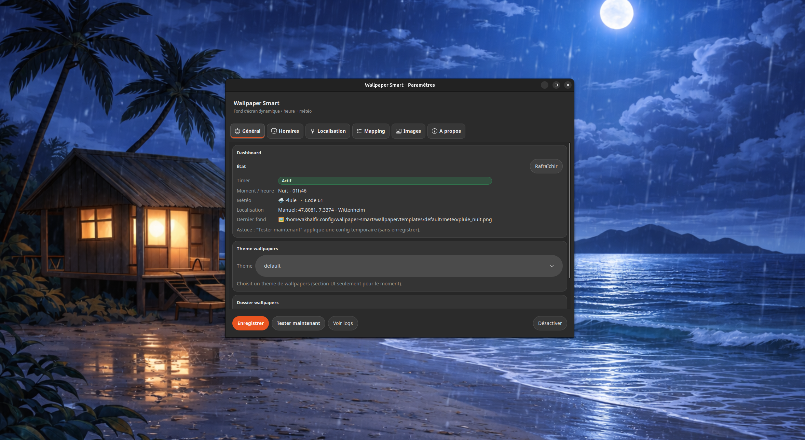
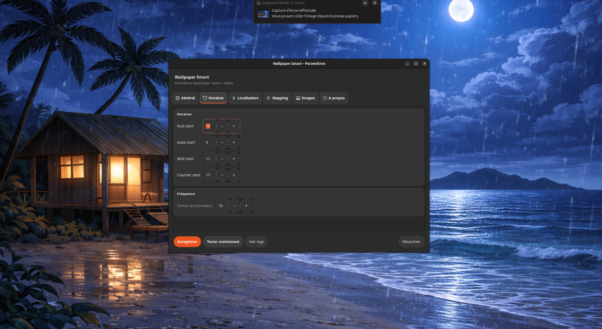
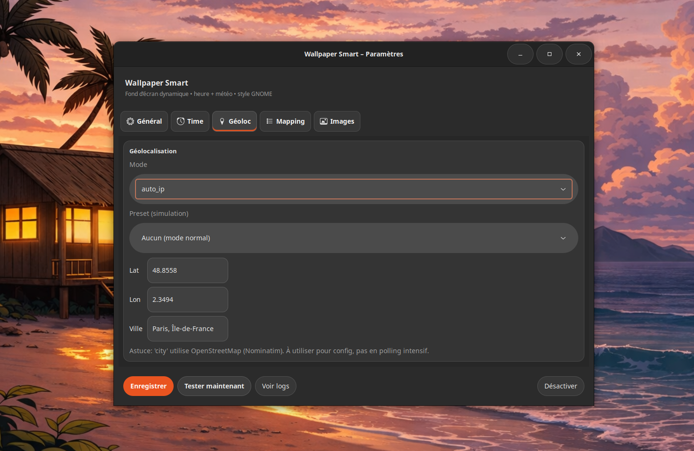
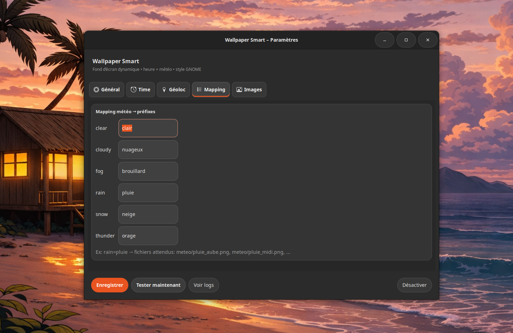
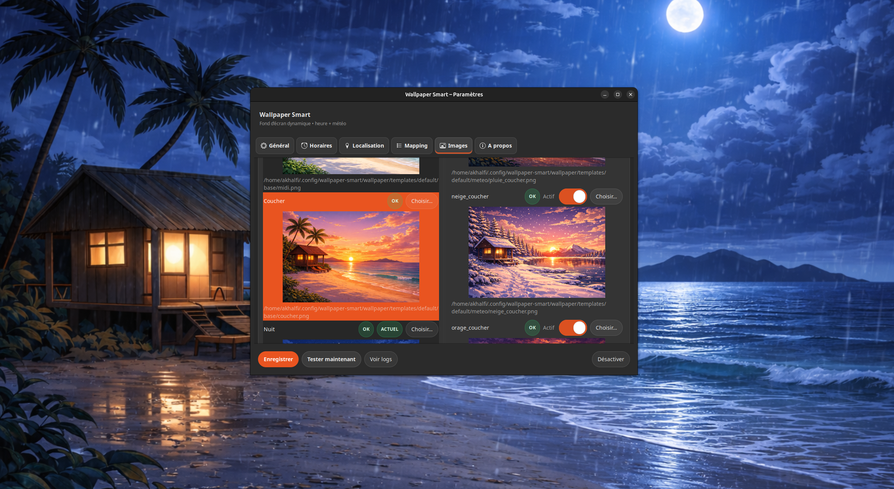

# Wallpaper Smart

[](LICENSE)


Wallpaper Smart est une application Linux (GNOME) qui change automatiquement le fond d’écran selon :

✅ l’heure de la journée (aube / midi / coucher / nuit)  
✅ la météo en temps réel (Open-Meteo)  
✅ un système de thèmes via des templates  
✅ une interface GTK simple et moderne pour gérer la configuration

---

## ✨ Fonctionnalités

- 🌗 **Fond d’écran dynamique par moment**
  - aube / midi / coucher / nuit

- 🌦️ **Météo en temps réel**
  - clear / cloudy / fog / rain / snow / thunder
  - mapping configurable (`clair`, `nuageux`, etc.)

- 🎨 **Thèmes de wallpapers**
  - gestion via dossier `templates/<theme>/...`
  - sélection dans l’UI

- 🖥️ **Interface GTK (Wallpaper Smart UI)**
  - aperçu des images
  - sélection rapide des fichiers
  - activation/désactivation par image météo
  - test immédiat sans sauvegarder

- ⏱️ **Mise à jour automatique via systemd timer**
  - exécution toutes les X minutes

---

## 🧩 Compatibilité

- ✅ Ubuntu / Debian
- ✅ GTK3
- ✅ systemd (user services)
- ✅ GNOME
- ✅ KDE Plasma (support via script)

> L'application detecte automatiquement l'environnement (GNOME / KDE) et applique le wallpaper via la methode adaptee.

---

## 📦 Dépendances

Installées automatiquement via `install.sh` :

- `curl`
- `jq`
- `python3-gi`
- `python3-gi-cairo`
- `gir1.2-gtk-3.0`
- `qdbus-qt5`


---

## 📁 Structure du projet

```
.
├── install.sh
├── uninstall.sh
├── src/
│   ├── wallpaper-smart.sh
│   ├── wallpaper-smart-ui
│   ├── wallpaper-smart.service
│   ├── wallpaper-smart.timer
│   └── wallpaper-smart-mkplaceholders.sh
└── wallpaper/
    └── templates/
        ├── default/
        │   ├── base/
        │   │   ├── aube.png
        │   │   ├── midi.png
        │   │   ├── coucher.png
        │   │   └── nuit.png
        │   └── meteo/
        │       ├── clair_aube.png
        │       ├── clair_midi.png
        │       └── ...
        └── flat/
            ├── base/
            └── meteo/
```

---

## 📸 Screenshots

> Ajoute tes screenshots dans `assets/screenshots/` puis adapte les liens ici.

Exemples :

- Général  
  

- Planning  
  
  
- Géoloc  
  

- Mapping  
  

- Images  
  


---

## 📌 Installation

### 1) Cloner le repo

```bash
git clone https://github.com/<ton-user>/<ton-repo>.git
cd <ton-repo>
```

### 2) Lancer l’installateur

```bash
chmod +x install.sh
./install.sh
```

✅ Une entrée apparaîtra dans tes applications : **Wallpaper Smart**

---

## ⚙️ Configuration

Le fichier de configuration est ici :

```bash
~/.config/wallpaper-smart/config.json
```

Exemple :

```json
{
  "wallpaper_dir": "/home/user/Images/wallpaper",
  "wallpaper_theme": "default",
  "timer_minutes": 10,
  "schedule": {
    "nuit_start": 19,
    "aube_start": 5,
    "midi_start": 11,
    "coucher_start": 17
  },
  "weather_mapping": {
    "clear": "clair",
    "cloudy": "nuageux",
    "fog": "brouillard",
    "rain": "pluie",
    "snow": "neige",
    "thunder": "orage"
  },
  "geolocation": {
    "mode": "auto_ip",
    "fixed": { "lat": 48.5839, "lon": 7.7455 },
    "city_name": "Strasbourg",
    "preset": "none"
  },
  "enabled_images": {}
}
```

---

## 🎨 Templates & thèmes

Wallpaper Smart utilise une structure stricte pour valider un thème.

### ✅ Un thème est valide si :

- `templates/<theme>/base/` existe
- et contient au minimum :
  - `aube.png`
  - `midi.png`
  - `coucher.png`
  - `nuit.png`

Exemple :

```
templates/default/base/aube.png
templates/default/base/midi.png
templates/default/base/coucher.png
templates/default/base/nuit.png
```

### Météo (optionnel)

Si tu veux activer la météo :

```
templates/<theme>/meteo/<prefix>_<moment>.png
```

Exemples :

```
templates/default/meteo/pluie_aube.png
templates/default/meteo/pluie_midi.png
templates/default/meteo/pluie_coucher.png
templates/default/meteo/pluie_nuit.png
```

Les `<prefix>` sont configurés dans l’onglet **Mapping** de l’UI.

---

## ▶️ Lancer l'application

```bash
~/.local/bin/wallpaper-smart-ui
```

---

## 🧪 Test manuel (sans timer)

```bash
CONFIG_FILE="$HOME/.config/wallpaper-smart/config.json" ~/.local/bin/wallpaper-smart.sh
```

---

## 🕒 Timer systemd

Le timer systemd user est :

- `wallpaper-smart.timer`
- `wallpaper-smart.service`

Commandes utiles :

```bash
systemctl --user status wallpaper-smart.timer
systemctl --user start wallpaper-smart.service
journalctl --user -u wallpaper-smart.service -n 50 --no-pager
```

---

## 🧼 Désinstallation

```bash
chmod +x uninstall.sh
./uninstall.sh
```

---

## 🗺️ Roadmap

- [ ] Ajouter une section « À propos » dans l’interface
- [ ] Ajouter un bouton « Don »
- [ ] Améliorer les logs (interface plus lisible)
- [ ] Gestion avancée des thèmes (aperçu + import/export)
- [x] Support de KDE Plasma
- [x] Météo en temps réel pour les localisations prédéfinies
- [ ] Ajouter la gestion multilingue
- [ ] Détecter la géolocalisation à l’installation pour définir la latitude/longitude par défaut
- [ ] Section géolocalisation : en mode « Ville », récupérer la latitude/longitude à partir de la ville
- [ ] Section géolocalisation : en mode « Fixe », récupérer la ville à partir de la latitude/longitude
- [ ] Permettre la gestion des thèmes sombre et clair pour les fonds d’écran


---

## ❓ FAQ

### Pourquoi le wallpaper ne change pas ?
- Verifie que le timer est actif :
  ```bash
  systemctl --user status wallpaper-smart.timer
  ```
- Lance un test manuel :
  ```bash
  ~/.local/bin/wallpaper-smart.sh
  ```

### Ou sont les logs ?
```bash
journalctl --user -u wallpaper-smart.service -n 50 --no-pager
```

### Est-ce compatible KDE ?
Oui. Wallpaper Smart supporte GNOME et KDE Plasma.

---

## 🛡️ Licence

MIT License © SpiderDev  
Voir le fichier [LICENSE](LICENSE).

---

## 🤝 Contribuer

Les contributions sont bienvenues !

- forks + PR
- amelioration UI
- nouveaux themes wallpapers
- support multi-desktop (KDE etc.)

---

## ⭐ Remerciements

- **GTK / GNOME**
- **Open-Meteo API**
- **systemd user services**
- Ptifiela
- et tous les futurs contributeurs ❤️
